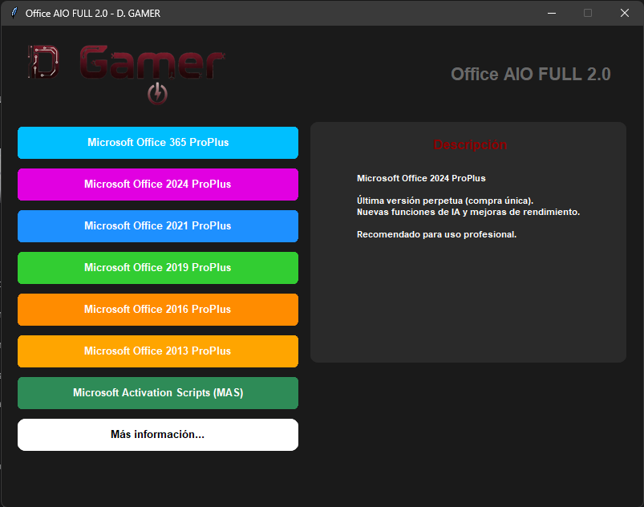
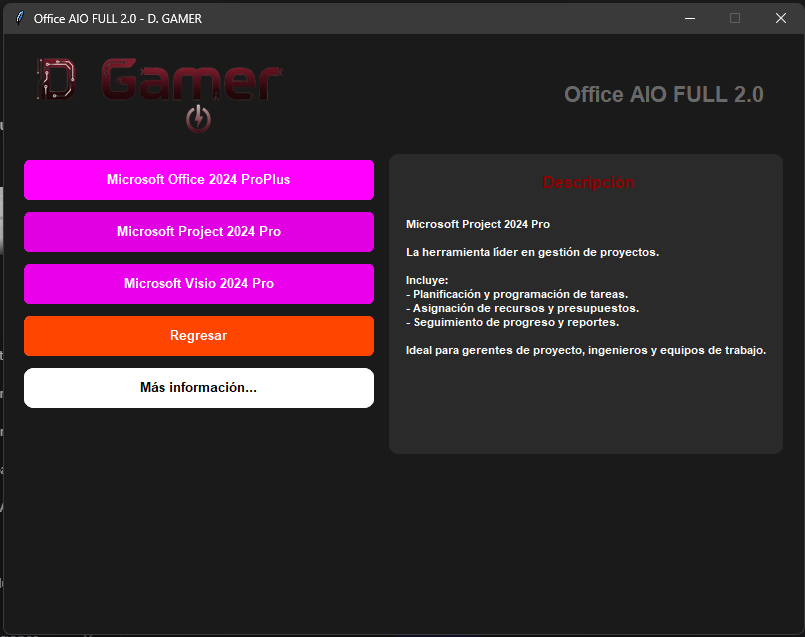

# 🏢 Office AIO FULL 2.0

**Suite completa para la instalación de Microsoft Office en cualquiera de sus versiones**

---

## 📖 Descripción

**Office AIO FULL 2.0** es una aplicación de escritorio que centraliza la descarga e instalación de todas las versiones de Microsoft Office (2013, 2016, 2019, 2021, 2024 y 365), incluyendo Project y Visio.

Incluye además integración con **Microsoft Activation Scripts (MAS)** para activación mediante métodos HWID y Ohook.

---

## ✨ Características

-  **Interfaz gráfica moderna** con modo oscuro
- 📦 **Archivo único** (.exe) - sin dependencias externas
- 🔄 **Todas las versiones** de Office disponibles
- 📊 **Project y Visio** incluidos en cada versión
- 🔐 **MAS integrado** para activación
- 📝 **Descripciones dinámicas** al pasar el mouse
- 🧹 **Limpieza automática** de archivos temporales

---

## 💻 Requisitos

- **Sistema operativo:** Windows 10 / 11 (64 bits)
- **Permisos:** Administrador (para instalación y MAS)
- **Conexión a internet:** Requerida para descargas

---

## 📥 Instalación

1. Descarga el archivo `Office_AIO_2.0.exe` desde la sección [Releases](https://github.com/Hellowen6060/OfficeInstaller/releases)
2. Haz doble clic en el archivo
3. Si Windows SmartScreen muestra una advertencia:
   - Haz clic en **"Más información"**
   - Luego en **"Ejecutar de todos modos"**

> ⚠️ **Nota:** No es necesario instalar Python ni ninguna dependencia. Todo está incluido en el ejecutable.

---

##  Uso

1. **Selecciona la versión** de Office que deseas instalar (365, 2024, 2021, 2019, 2016, 2013)
2. **Elige el producto:** Office, Project o Visio
3. La descarga e instalación comenzarán automáticamente
4. Para activación, usa el botón **"Microsoft Activation Scripts (MAS)"**

---

## 🛠️ Tecnologías

| Tecnología | Uso |
|-----------|-----|
| [Python 3.14](https://www.python.org/) | Lenguaje principal |
| [CustomTkinter](https://github.com/TomSchimansky/CustomTkinter) | Interfaz gráfica |
| [Pillow](https://python-pillow.org/) | Manejo de imágenes |
| [PyInstaller](https://pyinstaller.org/) | Empaquetado en .exe |

---

## 📸 Capturas

| Menú Principal | Submenú |
|:---:|:---:|
|  |  |

---

## 🤝 Contribuciones

Las contribuciones son bienvenidas. Si encuentras un bug o tienes una sugerencia, abre un [Issue](https://github.com/Hellowen6060/OfficeInstaller/issues) o un [Pull Request](https://github.com/Hellowen6060/OfficeInstaller/pulls).

---

## ⚖️ Licencia

Este proyecto está bajo la Licencia MIT. Consulta el archivo [LICENSE](LICENSE) para más detalles.

---

**Hecho con ❤️ por [Diego Garcia - D. GAMER](https://github.com/Hellowen6060)**

© 2026 - Todos los derechos reservados

